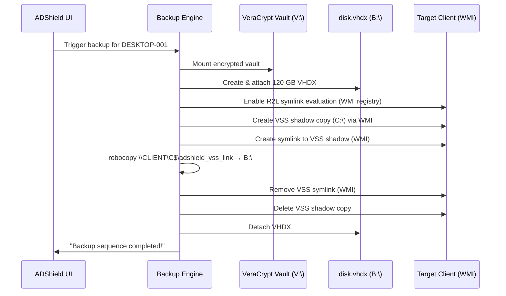

# AD Shield — Agentless Network Backup Orchestrator

**ADShield** is an enterprise-grade, agentless backup orchestrator for Windows Active Directory environments. It runs as a native Windows application (.NET 8 WinForms) on a Domain Controller or backup server, and coordinates encrypted VSS-based system backups across all domain computers — **zero software installed on target machines**.

---

## Key Features

- **100% Agentless** — Remote execution via WMI only; no client-side agents, scripts, or services
- **Server-Pull Architecture** — Robocopy runs locally on the backup server, pulling data from client admin shares. Eliminates Kerberos double-hop authentication failures
- **VSS Block-Level Backups** — Uses Windows Volume Shadow Copy for consistent, open-file safe snapshots
- **AES-256 Encrypted Storage** — All backup data lives inside a VeraCrypt encrypted container at rest
- **Per-Machine VHDX Isolation** — Each computer gets its own dynamically-sized virtual disk (`.vhdx`) inside the vault
- **LDAP AD Discovery** — Queries Active Directory directly via `System.DirectoryServices`; no AD PowerShell module needed
- **Automated Scheduling** — Built-in nightly incremental / weekly full cron-style scheduling
- **Self-Healing Storage** — Automatically detects and reformats uninitialized VHDX partitions mid-backup
- **Dark Enterprise UI** — Modern glassmorphism-inspired WinForms dashboard with real-time terminal log

---

## How It Works



The backup engine automatically sizes each VHDX to the remote machine's actual disk usage + 20% headroom, and self-heals any unformatted disk state.

---

## Project Structure

```
Active-Directory-Backup-Utility-main/
├── ADShield/                           # .NET 8 WinForms application
│   ├── Core/
│   │   ├── BackupOrchestrator.cs       # 8-step agentless backup pipeline (server-pull)
│   │   ├── AdDiscovery.cs              # LDAP AD computer discovery
│   │   ├── AppConfig.cs                # JSON config & history persistence
│   │   ├── VeraCryptManager.cs         # Encrypted vault mount/dismount
│   │   ├── VssManager.cs               # WMI VSS shadow copy management
│   │   ├── VhdxManager.cs              # Native VirtDisk.dll VHDX API
│   │   ├── SmbShareManager.cs          # WMI Win32_Share (legacy, retained for compat)
│   │   ├── SchedulerService.cs         # Cron-style backup scheduler
│   │   ├── BackupSelfHealingTest.cs    # VHDX self-healing regression tests
│   │   └── BackupServerPullTest.cs     # Server-pull architecture integration tests
│   ├── Forms/
│   │   ├── MainForm.cs                 # Application shell & 4-page nav
│   │   ├── MainForm.Events.cs          # UI event handlers
│   │   ├── BackupTriggerForm.cs        # Passphrase + backup type modal
│   │   └── Theme.cs                    # Design token system (colors, fonts)
│   ├── Models/
│   │   ├── AppSettings.cs              # Configuration model
│   │   └── ComputerEntry.cs            # AD computer + backup status model
│   └── ADShield.csproj
├── backend/powershell/                 # Legacy PowerShell orchestrator scripts
├── docs/
│   ├── architecture.md                 # System diagrams & component maps
│   ├── code-reference.md              # Full API reference
│   ├── deployment-guide.md            # Setup & operations guide
│   └── winpe_recovery.md              # Bare-metal recovery procedure
├── public/                             # Legacy web dashboard (Node.js era)
├── server.js                           # Legacy Express server
└── README.md
```

---

## Quick Start

### Prerequisites

| Requirement | Details |
|-------------|---------|
| Windows Server 2019+ or Windows 10 21H2+ | Domain-joined |
| .NET 8 Desktop Runtime | [Download](https://dotnet.microsoft.com/download/dotnet/8) |
| VeraCrypt v1.26+ | [Download](https://www.veracrypt.fr) |
| Domain Administrator account | Required for WMI remote access and admin share (`C$`) |
| **Run as Administrator** | Required for diskpart, WMI impersonation |

### Build & Run

```powershell
# Clone the repository
git clone <repo-url>
cd Active-Directory-Backup-Utility-main

# Build
dotnet build ADShield\ADShield.csproj

# Publish (self-contained optional)
dotnet publish ADShield\ADShield.csproj -c Release -r win-x64 --self-contained false

# Run as Administrator
.\ADShield\bin\Release\net8.0-windows\win-x64\publish\ADShield.exe
```

### First Backup

1. **Run** `ADShield.exe` as Administrator
2. **Configure** the VeraCrypt vault path and mount letter in **System Config**
3. **Sync** Active Directory to discover domain computers
4. **Click** a computer → **Backup** → Enter passphrase → **Full Backup**

For full instructions, see 📖 **[docs/deployment-guide.md](docs/deployment-guide.md)**

---

## Documentation

| Document | Description |
|----------|-------------|
| [architecture.md](docs/architecture.md) | System diagrams, component maps, data flows, security model |
| [code-reference.md](docs/code-reference.md) | Complete class/method API reference |
| [deployment-guide.md](docs/deployment-guide.md) | Installation, configuration, operations, troubleshooting |
| [winpe_recovery.md](docs/winpe_recovery.md) | Bare-metal recovery with WinPE + VeraCrypt Portable |

---

## Architecture Overview

### Server-Pull Backup Architecture

The backup engine uses a **server-pull** model where robocopy runs locally on the backup server and reads from the client's admin share (`\\CLIENT\C$`). This eliminates the Kerberos double-hop authentication problem that occurs when a remote process tries to access a third-party network resource.

```
Backup Server (TESTWIN11)                Target Client (LOCALVM)
│                                        │
│── WMI: Enable R2L symlink eval ──────> │   (one-time registry setting)
│── WMI: Create VSS shadow copy ──────>  │   (single network hop)
│── WMI: Create symlink to VSS ────────> │   (single network hop)
│                                        │
│── LOCAL robocopy ────────────────────>  │
│   Source: \\LOCALVM\C$\adshield_vss_link   (single hop: server → client)
│   Dest:   B:\ (local VHDX)                (local write, no network)
│                                        │
│── WMI: Remove symlink ──────────────>  │
│── WMI: Delete VSS shadow ───────────>  │
```

### Storage Architecture

```
VeraCrypt Vault (V:\)           — AES-256 encrypted container
└── backups\
    ├── DESKTOP-001\
    │   └── disk.vhdx           — 120 GB NTFS virtual disk (dynamically expanding)
    │       └── VSS backup data
    ├── LAPTOP-002\
    │   └── disk.vhdx
    └── SERVER-03\
        └── disk.vhdx
```

### Technology Stack

| Component | Technology |
|-----------|------------|
| UI | Windows Forms (.NET 8) |
| AD Integration | `System.DirectoryServices` (LDAP) |
| Remote Management | WMI `Win32_Process`, `Win32_ShadowCopy`, `StdRegProv` |
| Virtual Disk | `VirtDisk.dll` (P/Invoke native API) |
| Encryption | VeraCrypt AES-256 / SHA-512 |
| File Copy | `robocopy.exe` (runs locally with `/B` backup mode) |
| Persistence | `Newtonsoft.Json` |

---

## Security Design

- **Passphrase never stored** — VeraCrypt passphrase is entered at runtime and held in memory only
- **No SMB shares required** — Server-pull architecture reads from pre-existing admin shares (`C$`); no dynamic shares created
- **Per-machine ACLs** — VHDX root grants access to the specific target machine's domain account (`DOMAIN\ComputerName$`)
- **Encrypted at rest** — All VHDX files reside inside the AES-256 VeraCrypt container
- **R2L symlink evaluation** — Enabled per-client via WMI registry write; allows traversal of VSS symlinks through admin shares

---

## Testing

ADShield includes two integration test suites:

| Test Suite | Tests | Purpose |
|------------|-------|---------|
| `BackupSelfHealingTest` | 3 | VHDX creation, formatting, and self-healing recovery |
| `BackupServerPullTest` | 3 | R2L enablement, VSS symlink access, end-to-end server-pull robocopy |

Tests are triggered from the ADShield UI via the maintenance panel.

---

## License

See [LICENSE](LICENSE) for details.
