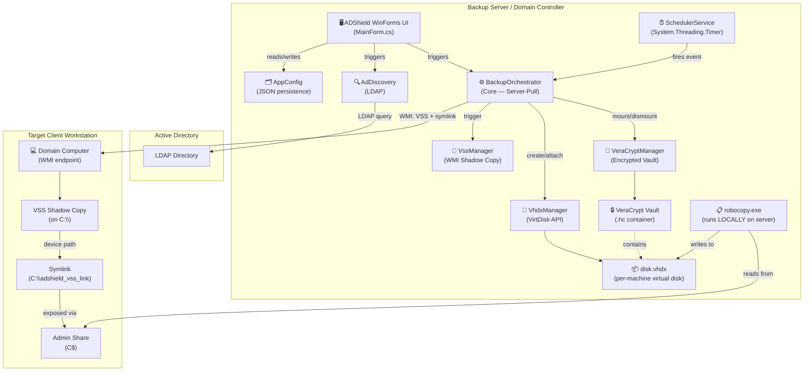
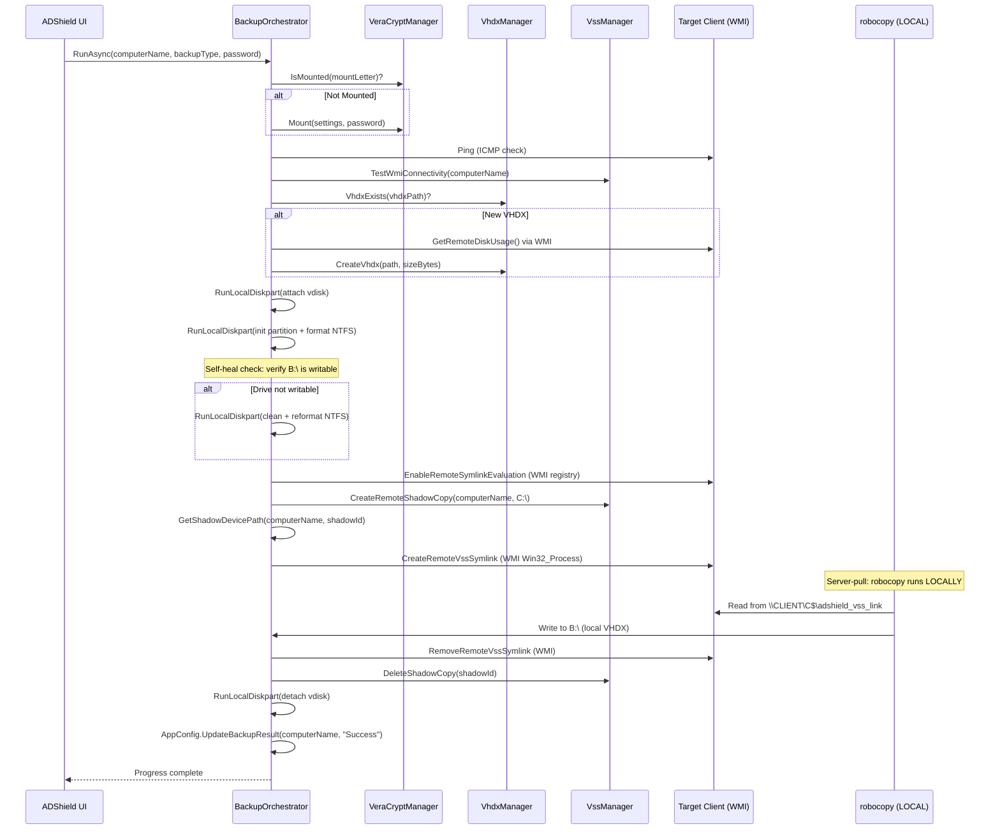
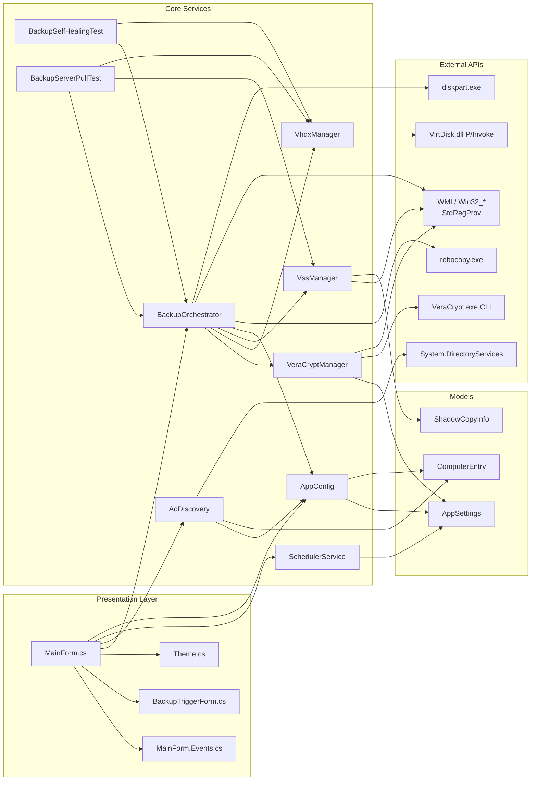
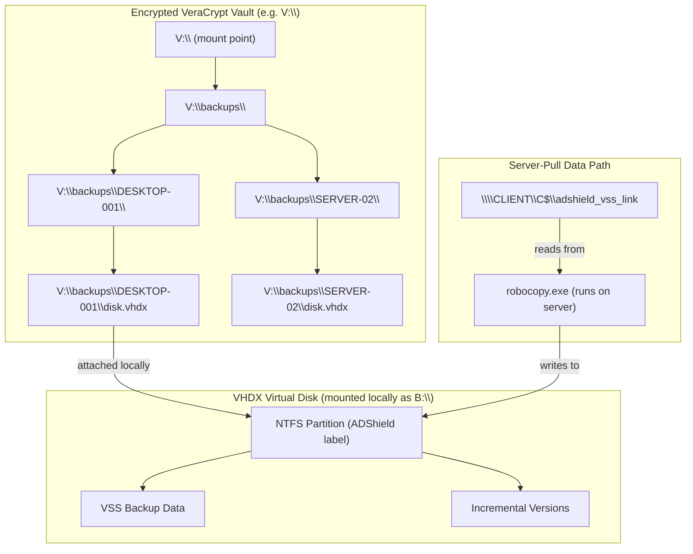
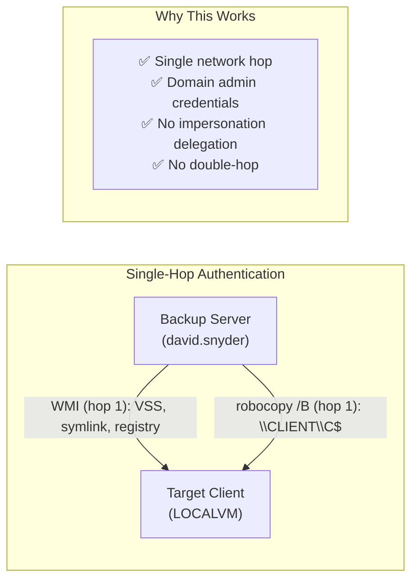
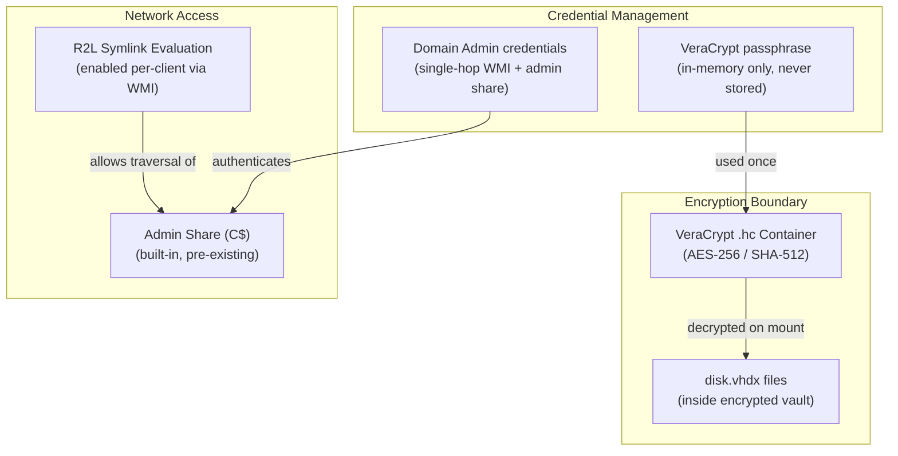
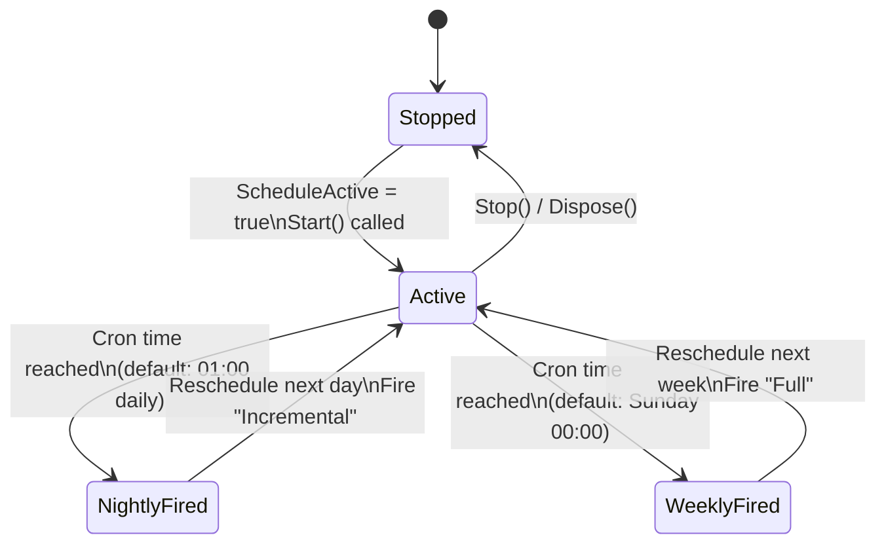

# ADShield Architecture Documentation

## Overview

ADShield is an **agentless, encrypted network backup orchestrator** for Windows Active Directory environments. It runs as a native Windows Forms application (.NET 8) on a Domain Controller or backup server, and coordinates full system-image and incremental VSS backups across all domain computers — without installing any software on target machines.

The backup engine uses a **server-pull architecture**: robocopy runs locally on the backup server and reads from each client's admin share (`\\CLIENT\C$`) through a VSS symlink. This eliminates the Kerberos double-hop authentication problem entirely.

---

## System Architecture

### High-Level Component Diagram



---

### Backup Sequence Flow (Server-Pull)



---

### Component Dependency Map



---

## Data Flow: Backup Storage Architecture



---

## Network Authentication Model



### Previous Architecture (Deprecated)

The old client-push model ran robocopy ON the client, which required a second authentication hop back to the server's SMB share. This caused `ERROR 5 (Access Denied)` due to the Kerberos double-hop restriction:

```
Server → Client (hop 1) → Server SMB share (hop 2) ❌ BLOCKED
```

The server-pull model eliminates this:

```
Server → Client admin share (hop 1 only) ✅
```

---

## Technology Stack

| Layer | Technology | Purpose |
|-------|-----------|---------|
| **UI Framework** | Windows Forms (.NET 8) | Desktop GUI for backup management |
| **Language** | C# 12 | Core application logic |
| **AD Integration** | `System.DirectoryServices` | LDAP queries against Active Directory |
| **Remote Management** | WMI (`System.Management`) | Agentless remote VSS, symlinks, registry |
| **Virtual Disk** | `VirtDisk.dll` (P/Invoke) | Native VHDX creation, attach, detach |
| **Disk Partitioning** | `diskpart.exe` (local shell) | NTFS format, partition assignment |
| **Encryption** | `VeraCrypt.exe` (CLI) | AES-256 container mount/dismount |
| **File Copy** | `robocopy.exe` (local, `/B` mode) | Server-pull data transfer with backup privilege |
| **Persistence** | `Newtonsoft.Json` | Config and history serialization |
| **Scheduling** | `System.Threading.Timer` | Cron-style nightly/weekly triggers |

---

## Security Architecture



**Security Principles:**
- The VeraCrypt passphrase is **never persisted** to disk; it is entered at runtime per-backup session
- No dynamic SMB shares are created — the server reads from the **pre-existing admin share** (`C$`)
- R2L symlink evaluation is enabled via **WMI registry write** (`StdRegProv`), not manual configuration
- All backup data at rest is inside an **AES-256 encrypted** VeraCrypt volume
- Robocopy runs with `/B` (backup mode) using `SeBackupPrivilege` for ACL bypass on source files

---

## Scheduler Architecture



---

## Test Suites

### BackupSelfHealingTest

Tests the VHDX lifecycle and self-healing format recovery:

| Test | What It Validates |
|------|-------------------|
| `TestVhdxCreateAndFormat` | VHDX creation via VirtDisk API + diskpart NTFS format |
| `TestSelfHealDetection` | Detects unwritable/RAW partitions and triggers reformat |
| `TestQuickFormatRecovery` | Full clean → GPT → NTFS recovery pipeline |

### BackupServerPullTest

Tests the server-pull backup architecture end-to-end:

| Test | What It Validates |
|------|-------------------|
| `TestR2LSymlinkEvaluation` | WMI registry write to enable R2L on remote client |
| `TestVssSymlinkAccess` | VSS shadow + symlink creation → server `Directory.GetDirectories()` via admin share |
| `TestEndToEndServerPull` | Full pipeline: VHDX → VSS → symlink → robocopy pull → verify copied data |
