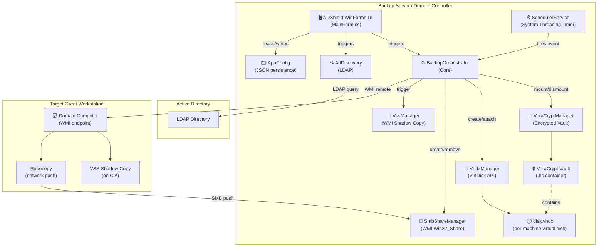
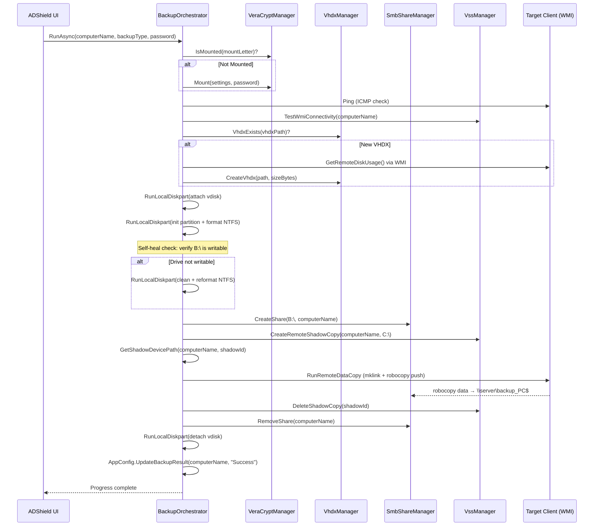
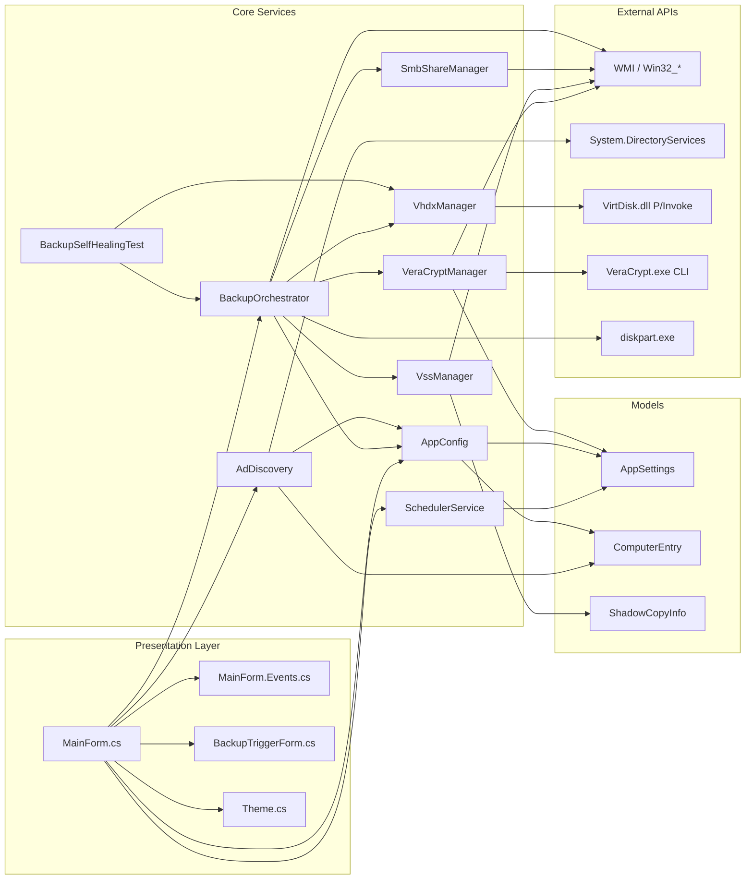
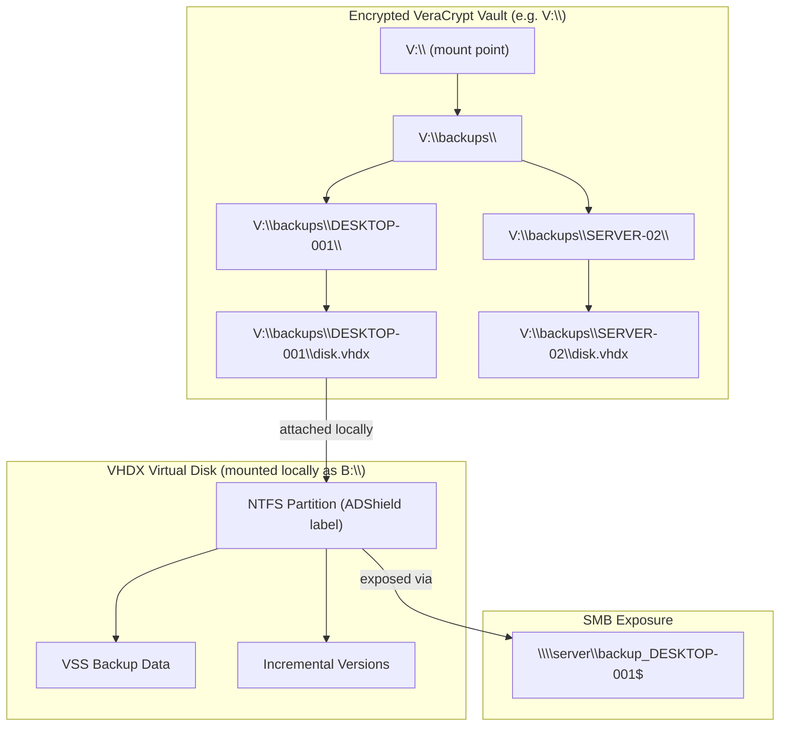
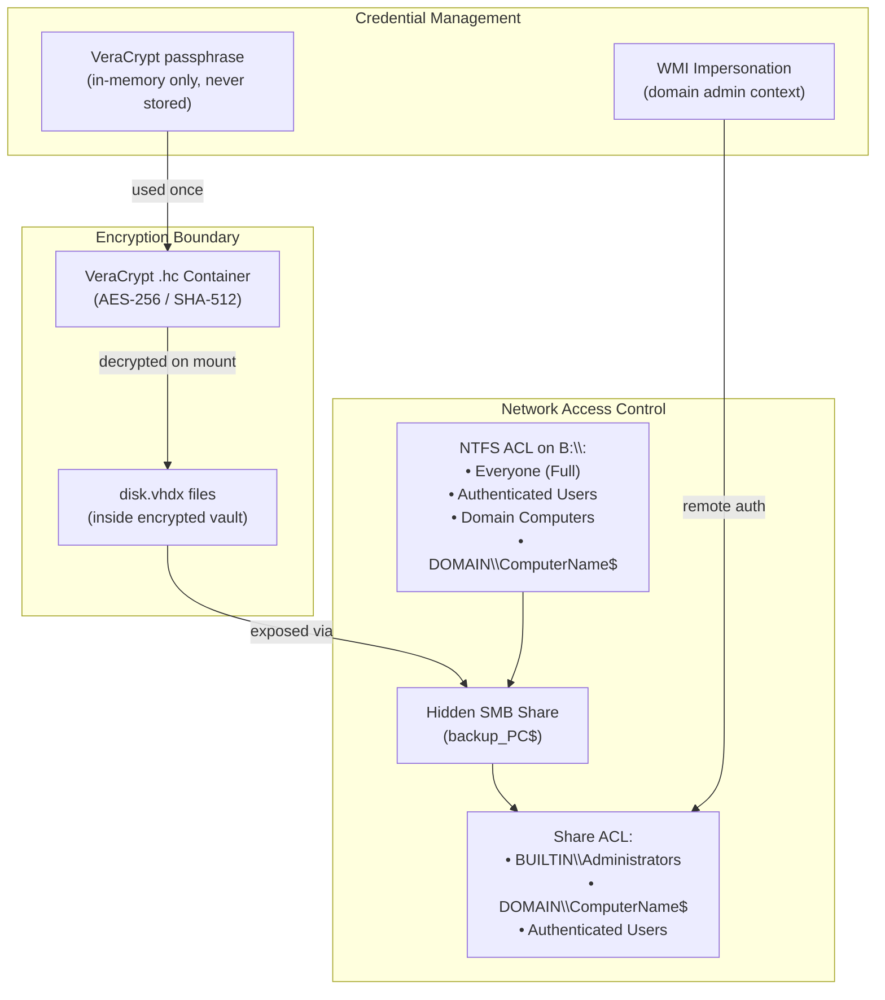
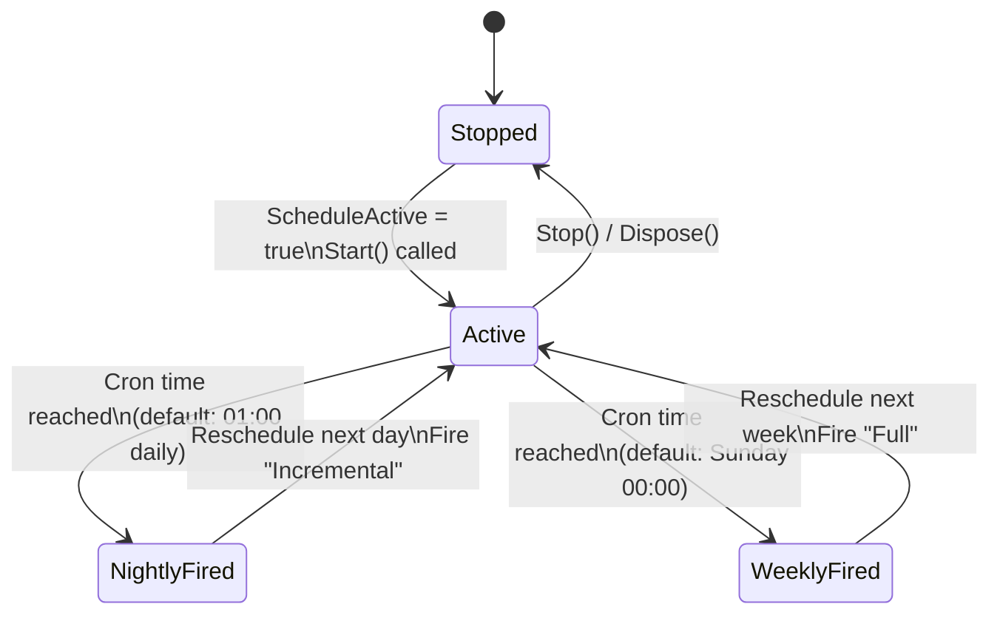

# ADShield Architecture Documentation

## Overview

ADShield is an **agentless, encrypted network backup orchestrator** for Windows Active Directory environments. It runs as a native Windows Forms application (.NET 8) on a Domain Controller or backup server, and coordinates full system-image and incremental VSS backups across all domain computers — without installing any software on target machines.

---

## System Architecture

### High-Level Component Diagram

---

### Backup Sequence Flow

---

### Component Dependency Map

---

## Data Flow: Backup Storage Architecture

---

## Technology Stack

| Layer | Technology | Purpose |
|-------|-----------|---------|
| **UI Framework** | Windows Forms (.NET 8) | Desktop GUI for backup management |
| **Language** | C# 12 | Core application logic |
| **AD Integration** | `System.DirectoryServices` | LDAP queries against Active Directory |
| **Remote Management** | WMI (`System.Management`) | Agentless remote execution, VSS, process control |
| **Virtual Disk** | `VirtDisk.dll` (P/Invoke) | Native VHDX creation, attach, detach |
| **Disk Partitioning** | `diskpart.exe` (local shell) | NTFS format, partition assignment |
| **Encryption** | `VeraCrypt.exe` (CLI) | AES-256 container mount/dismount |
| **File Copy** | `robocopy.exe` (via WMI) | VSS shadow-to-share data transfer |
| **Persistence** | `Newtonsoft.Json` | Config and history serialization |
| **Scheduling** | `System.Threading.Timer` | Cron-style nightly/weekly triggers |
| **SMB Shares** | WMI `Win32_Share` | Dynamic hidden share creation/removal |

---

## Security Architecture

**Security Principles:**
- The VeraCrypt passphrase is **never persisted** to disk; it is entered at runtime per-backup session
- Backup SMB shares are **dynamically created and destroyed** — they only exist during an active backup window
- Shares are **hidden** (trailing `$`) and restricted to the target machine's AD computer account
- All backup data at rest is inside an **AES-256 encrypted** VeraCrypt volume

---

## Scheduler Architecture

